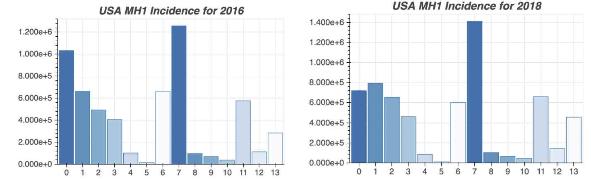

# CS 5010 Semester Project: Mental Health

Kelly Farell - knf7vg@virginia.edu

Samy Kebaish - sak3qf@virginia.edu

Gretchen Larrick - jem37b@virginia.edu

GitHub Repository - https://github.com/samykebaish/cs5010_data_analysis_project

## Introduction
Mental health impacts everyone on an individual level, but it can be hard to visualize what the distribution of mental illness and treatment are across the United States. Using descriptive statistics, exploratory analyses, and an interactive website complete with visualizations was created to help patients, treatment providers, and the general public engage with diagnostic and healthcare information regarding mental illness and care. Additionally, trend analyses and traditional and machine-learning (ML) modeling methods were used to observe shifts over time and predict level of care and mental health diagnoses.

## Datasets
Our primary datasets include Adult and Child Health Care Quality Measures for fiscal year 2018. Each year, the Centers for Medicare and Medicaid Services (CMS) collects benchmark data from a variety of treatment providers, with the goal of summarizing the quality of care received by adult Medicaid recipients and CHIP beneficieries.  We also used the Mental Health Client-Level Data (MH-CLD) from SAHMSA (Substance Abuse and Mental Health Services Administration, a part of the US Department of Health and Human Services). We primarily focused on the year 2018, but trend analyses included data from 2013-2018. For some supplemental information regarding poverty by state, we utilized the Kaiser Family Foundation's State Facts database summarizing poverty rate by race and ethnicity, and geoJson files containing location coordinates for US state boundaries (Story and Fernandez, 2016), and state abbreviation/FIPS (World Population Review (n.d.)) to generate choropleths and merge datasets which utilized different encoding methods for state.

Table 1: Dimensions of the primary datasets used in analysis and modeling mental health and treatment in the United States.

### Adult and Child Health Care Quality Measures
The Social Security Act enacted by the federal government requires that an annual report of predefined core measures of healthcare quality for adult Medicaid enrollees. Based on data from electronic health records and reports from treatment centers which accept Medicaid and CHIP, this dataset contains state-level performance rates for many aspects of health, including behavioral healthcare, prenatal and pregnancy-related healthcare, and early childhood care. Reporting rates vary considerably across measures--newly defined or updated measures often have lower participation rates due to the required changes that must be made to a state's health department infrastructure necessary to support the changes to research methodology.

### MH-CLD
The Mental Health Client-Level Data contain demographic, diagnoses, and treatment setting and outcome for individuals receiving services through their state mental health agency. The analyses and modeling relied on variables such as education, race, ethnicity, age, gender, primary, secondary, and tertiary mental health diagnoses, and indicators of diagnosis in a variety of illness categories (such as depressive disorders or personality disorders).

These data are somewhat limited--although the year was reported, months and days were excluded. These details would provide supplemental benefit due to the seasonality of depression. For example, in a study by Ayers et al. in 2013, Google mental health queries monitored from 2006 to 2010 revealed seasonal patterns for all mental health queries, with winter peaks and summer troughs (14% difference in the United States; 11% difference for Australia).

### KFF Datasets
Based on US Census surveys, the Kaiser Family Foundation estimated the rate of people living at or under the federal poverty line for the year 2018 and grouped that data by state, race, and ethnicity.

### Geographic Data
Two different datasets were utilized in order to create interactive choropleths and to join the MH-CLD and health quality measures data. One included the list of state names, abbreviations, and the state FIPS codes, which are used to identify states in the MH-CLD data (). The other  contains state boundary data through arrays of coordinates (Story and Fernandez, 2016).

## Tech Stack
Code was written in Jupyter Notebook (Kluyver et al., 2016) for reproducibility and easy annotation.

Much of the exploratory data analysis was conducted with functions imported from NumPy (Harris et al., 2020) and Pandas (McKinney et al., 2010).

Visualizations for the exploratory data analysis were produced using Matplotlib (Hunter et al., 2007) and seaborn (Waskom et al., 2017). Plotly (Plotly Technologies Inc, 2015) was used to create further exploratory visualizations, as well as interactive graphics such as choropleths for the website.

Plots related to the logistic regression and advanced ML modeling were created using Plotly (2015) and bokeh (Bokeh Development Team, 2021).

Code for modeling was primarily written using Scikit (Pedregosa et al., 2011), Keras (Chollet et al., 2015), and _Flask (Grinberg, 2018). The website was hosted by AWS.

## Preprocessing
The datasets were carefully cleaned by the governmental and nongovernmental research agencies prior to publishing, so little preprocessing was required. However, null/missing values needed to be accounted for and the datasets needed to be merged together for some of the analyses.

### Irrelevant Data
Rows from the Adult and Child Health Care Quality Measures dataset which involved measures from treatment domains other than "Behavioral Health" were removed in order to focus on measures related to mental health. The rows were identified by filtering out rows from the column "Domain" which were not equal to "Behavioral Health" and excluding them from the dataset.

### Null Data
Null data in the MH-CLD and Adult and Child Health Care Quality Measures datasets were encoded using "#NR" or -9. These cells were removed prior to analysis and modeling. Since in nearly all cases, the data was categorical, some outlier handling techniques such as imputation with median values or upper quartile values was not possible.

### Joining Datasets
The Health Care Quality Measures dataset was merged with the folio state abbreviation list from World Population Review (n.d.) using state code/abbreviation as the shared identifier. The MH-CLD dataset was joined with the same state abbreviation list using the USPS state name as the shared identifier.

Finally, the merged Health Care Quality Measures data and merged MH-CLD data were then joined using the state code/abbreviation as the shared identifier.

## Exploratory Data Analysis
With the data cleaned, relevant descriptive statistics and other trends could be identified in order to inform the visualizations and prediction models.
### MH-CLD
#### Single Variable Analysis

The MH-CLD data set consists of a large number of categorical variables corresponding to a specific state.  To understand the data, the first object was the look at the total number of entries per state, Figure X.

Figure X:  Mental Health Cases per State

The next part of the exploratory analysis was to sort through the guidebook provided by  SAMHA detailing the breakdown of the variables in the dataset. Age and mental health diagnosis have a high number of populated categories so these were the main areas of focus.

The first to explore is age. The variable is not an integer age, but a range of ages. The first goal is to get a visualization of each age group‘s total count, figure y. This shows that the 0-11 age group has a significant number of higher cases than the other age groups.

Figure Y:  Age Group Totals

With the dataset broken down into states, the data is then group into age groups by state, figure y. Again, the 0-11 age range has the highest number of cases in a majority of the states.

Figure Z:  Age Group Totals by State

The same analysis was completed on the mental health diagnosis variable. The totals for each mental health diagnosis are shown in figure a. Depression has the highest number of cases in this dataset.

Figure A:  Mental Health Diagnosis Totals

The variable is then broken down by state, figure z, and the conclusion of which mental health diagnosis is the highest isn’t as clear as with the age analysis. The breakdown of the state mental health diagnosis is much more varied.

Figure B:  Mental Health Diagnosis Totals by State

#### Multivariable Analysis

After looking at age and mental health diagnosis separately, how do these two variables relate to each other? In figure c, age ranges are grouped by their mental health diagnosis. From this, it is seen that the depressive mental health diagnosis is prominent in most of the age groups, with a higher instance after an individual is over the age of 15.

Figure B:  Age groups by Mental Health Diagnosis

There is a difference in diagnoses for individuals who are over 18 in relation to individuals under the age of 18. Individuals under the age of 18 have a much higher number of cases in the ADD/ADHD, Trauma/Stressors, and Oppositional Defiant Disorders categories. After the age of 18, there is an increase in depression, but it varies in the over 18 age groups, but each group remains higher individually than the under 18 age groups.

No prediction value was added by utilizing the poverty dataset. For that reason, we chose to eliminate it from future consideration in our models. The analyses showing no meaningful insights with the poverty data included can be seen in our code within the team's GitHub repository.

### Adult and Child Health Care Quality Measures
Overall, the measures using the adult population had a higher percentage of nonmissing data than the child population. On the documentation for the original dataset, SAHMSA indicates that comparison of the child dataset with past years may not be fasible because some measures were only created or standardized in recent years. As a result of the changes, many states do not have sufficient data to be included in the analyses.

Figure 1: National Average Performance on Health Care Quality Measure (child population - right, adult population - left)

Choroleth 1: The percentage of adults who received a follow-up visit with an outpatient treatment provider after discharge from hospitalization for mental illness, by US state

Choropleth 2: The percentage of adults who received a follow-up visit with an outpatient treatment provider after an emergency room visit for mental illness, by US state

While follow-up visits with outpatient treatment providers are more likely to occur when a patient is discharging from the hospital, rather than after being screened out in the emergency room, states' performance on this measure had a range of about 35% to 80%.

## General Linearized Model

### Principal Component Analysis
A Principal Component Analysis was used to evaluate all variables in the combined CLD-Health Care Quality Measures dataset.

### Logistic Regression

## Trend Analysis
As data has been garnered since the year 2013 in a consistent fashion, we decided to conduct analyses on whether mental illness incidence has been increasing. To our surprise, the rates of mental illness have been fairly consistent throughout the years, and the diagnostic comparison between males and females followed a similar trend line amongst both groups. Moreover, disease distribution was also demonstrated to be consistent among years. For example, see Figure X for the distribution of mental health illnesses in 2016 as compared to 2018. However, in future studies, more extensive analysis is warranted. Namely, in our analysis, we did a deep dive into the dataset related to 2018. In order to present a truly robust representation, a similar level of depth would be necessary for each year (from 2013 onwards), which then can make comparisons more meaningful.

## Above and Beyond: Advanced ML Methods and Interactive Website
As part of our advanced analysis, we investigated the potential usage of machine learning algorithms towards uncovering trends related to various features and labels of our dataset. The labels we used included a mix of demographic, whereas the labels were based on multiple disorder diagnoses (Table X). The range of values for the labels and features were either binary (0 or 1), polyadic (e.g. -9, 1, 2, 3, 4) and continuous (0-100). Some of the features includes were age, education, ethnicity, race, substance abuse history, marital status, veteran status etc. The labels investigated included multiple disorders - such as major depressive disorder, ADHD, anxiety, schizophrenia - which were coded 0 for absence and 1 for presence thereof. Based on the structure of the data, we evaluated three separate machine learning models: Naive Bayes, K-Nearest Neighbors and a multilabel classification model using ADAM optimization. The NB and KNN classifiers were conducted using the scikit-learn library, whereas the multilabel classification model was derived from the keras library.
### Naive Bayes
The three models differed in their properties and use cases. In the case of Naive Bayes (NB), as the name suggests, Naive bayes utilizes Bayes theorem (that the probability of an event can be based on prior knowledge of conditions which may have a relation to the event) in conjunction with the “naive” assumption that the attributes are conditional independent. As a supervised learning technique, Naive Bayes is considered to be a decent classifier, extremely fast compared to sophisticated methods, but a bad estimator, particularly as datasets become more complex. There are multiple types of naive bayes, including Gaussian (Figure X), Multinomial, Complement, Bernoulli, Categorical, and “Out-of-core” Naive Bayes model fitting. The Naive Bayes algorithm utilized in this case was GaussianNB. Unlike the KNN and Multilabel classifier (discussed in subsequent paragraphs), the Naive Bayes classifier could handle multiple features, but was limited to a single label output. Accordingly, our implementation meant that, in order to evaluate multiple labels, each one would need to be done individually, and the others followed in iterative O(n) fashion.

### k-Nearest Neighbors & Multilabel Classification Optimization
K Nearest Neighbors is an algorithm which assumes that similar data points are close to or “neighbor” one another. It can be used to solve classification and regression problems. We used a KNN classifier due to its ability to handle multi feature, multilabel data. Additional, we use keras for similar, albeit more robust, multifeature, multilabel classification. Keras is an intuitive deep learning API which acts as an interface for the Tensorflow Library. We implemented a Multilabel Classification using the ADAM optimization algorithm. The Adam optimization algorithm is used, as opposed to stochastic gradient descent, which stands for Adaptive Moment Estimation. Unlike stochastic gradients, which use single learning rates, the Adam algorithm implements both Adaptive Gradient Algorithm and Root Mean Square Propagation. These two mechanisms calculate an exponential moving average of the gradient and the squared gradient. As an example, we ran a Keras multi label classification model implementing initially 8 demographic variables (features) and 10 mental health diagnoses (labels) for the following representation: A 40-44 year old, High School Educated, Hispanic (other than Mexico or Puerto Rico), White in Ethnicity, Female, from California, who is divorced. The initial accuracy was only 36%, demonstrating the low impact of demographic variables in ascertaining mental health (for this dataset). However, after adding information about veteran status, substance abuse, homelessness, admissions to hospital and other clinical features (18 total), the maximum accuracy was 76.2%. Ultimately, accuracy scores were similar for KNN and multilabel classification, although multilabel classification had a lower sensitivity. 

### Findings

The findings from the machine learning model revealed intuitive trends behind the modeling output. Specifically, as the number of features was increased, there was also an increase in the accuracy of the output. Furthermore, demographic variables being added, such as age, race and sex, had a lesser effect on diagnosing as compared to variables such as substance abuse history, hospital admission, psychiatric ward admissions, and . Of the models, Naive Bayes had the highest accuracy but this was to be expected as it was measuring a single label. In using four features for a single label, NB had an accuracy of around 90% compared to 35% for KNN. Comparatively, K-nearest neighbors and the multilabel classifier had lower accuracy scores, but could handle much more complex labels. This is important depending on the use case. If you want to determine if a patient has a particular diagnosis, then NB is a better classifer. However, if you are interested in determining if a patient has multiple diagnoses, this is a more complicated affair, as some disorders may be comorbid with others. Accordingly, KNN and multilabel classifiers are ideal in those cases.

### Interactive Web Application

A website complete with user-interactive visualizations was created to encourage engagement with the datasets and analyses. The choropleths show the raw percentages for the Health Care Quality measure performance of a given state when the user hovers their mouse over it. The interactive web-based application was built in Flask. Flask is a Python web framework which implements the Jinja template engine to serve HTML files and the Wekzeug WGSI toolkit. We used three data visualization libraries as samples on this website, including seaborn, plotly express (to generate choropleth maps) and bokeh. Regarding the latter, we imported historical data from the years of 2013-2018 to determine the frequency of primary, secondary and tertiary diagnoses over the years. Users could select the year from the dropdown menu, prompting the redraw function to create a plot based on the attributes.

## Unit Testing
### MLH - CLD Dataset

The unit testing for this dataset was of a function that was written to remove Puerto Rico from the dataset. Below is a picture of the results. A data frame with and without Puerto Rico was created and tested using the function to remove Puerto Rico.

Moreover, when using a NB classifier, the parameter sizes must be very precise in order for the model to run properly. Here, we check the feature and labels to ensure they are of the proper dimensions. We also check if accuracy is above the 80% threshold.

## Conclusions

### MLH - CLD Dataset Investigation

Using age and mental health diagnosis to explore the mental health dataset allowed us to gain an understanding of who is receiving treatment and which diagnosis is the most prevalent. The age group 0-11 years had the highest number of cases overall and with most of the states. Most of these cases were in the ADD/ADHD and Trauma/Stressor category.  As the age increased, the diagnosis with the higher number of cases changed over to depression  To increase the understanding and awareness of mental health, adding more variables into the data set and looking more at how socioeconomic conditions impact the type of diagnosis received. In terms of machine learning models, additional testing can be conducted, such as investigating precision and recall scores.  

## Future Research Opportunities
Will trends change over the next few years due to covid-19?
Minority oversampling and future linear analyses
Other variables that could contribute

## Works Cited
Ayers, J. W., Althouse, B. M., Allem, J. P., Rosenquist, J. N., & Ford, D. E. (2013). Seasonality in seeking mental health information on Google. _American journal of preventive medicine_, 44(5), 520-525. https://www.sciencedirect.com/science/article/abs/pii/S0749379713000809

Bedre, R. (2021). "Performing and visualizing the Principal component analysis (PCA) from PCA function and scratch in Python". _Renesh Bedre Data Science Blog_. https://www.reneshbedre.com/blog/principal-component-analysis.html

Bokeh Development Team (2021). Bokeh: Python library for interactive visualization. https://bokeh.org

Chollet, F., & others. (2015). Keras. GitHub. Retrieved from https://github.com/fchollet/keras

Grinberg, M. (2018). _Flask web development: developing web applications with python_. " O&#x27;Reilly Media, Inc."

Harris, C. R., Millman, K. J., van der Walt, S. J., Gommers, R., Virtanen, P., Cournapeau, D., … Oliphant, T. E. (2020). Array programming with NumPy. _Nature_, 585, 357–362. https://doi.org/10.1038/s41586-020-2649-2

Hunter, J. D., "Matplotlib: A 2D Graphics Environment," in _Computing in Science & Engineering_, vol. 9, no. 3, pp. 90-95, May-June 2007, doi: 10.1109/MCSE.2007.55.

The Kaiser Family Foundation State Health Facts, Poverty Rate by Race/Ethnicity. Data Source: KFF estimates based on the 2008-2019 American Community Survey (United States Census Bureau), 1-Year Estimates.https://www.kff.org/2d5cbf8/

Kluyver, T., Ragan-Kelley, B., Fernando P&#x27;erez, Granger, B., Bussonnier, M., Frederic, J., … Willing, C. (2016). Jupyter Notebooks – a publishing format for reproducible computational workflows. In F. Loizides & B. Schmidt (Eds.), _Positioning and Power in Academic Publishing: Players, Agents and Agendas_ (pp. 87–90).

McKinney, W., & others. (2010). Data structures for statistical computing in python. In _Proceedings of the 9th Python in Science Conference_ (Vol. 445, pp. 51–56).

Pedregosa, F., Varoquaux, Ga"el, Gramfort, A., Michel, V., Thirion, B., Grisel, O., … others. (2011). Scikit-learn: Machine learning in Python. _Journal of Machine Learning Research_, 12(Oct), 2825–2830.

Plotly Technologies Inc (2015). Collaborative data science. Montreal, QC: Plotly Technologies Inc. Retrieved from https://plot.ly

Stojiljković, M. “Logistic Regression in Python.” _Real Python_, Real Python, 24 Nov. 2020, realpython.com/logistic-regression-python/#logistic-regression-in-python-with-scikit-learn-example-1.

Story, R., Fernandez, F. us-states.json. folium, 2016. https://raw.githubusercontent.com/python-visualization/folium/master/examples/data/us-states.json

Substance Abuse and Mental Health Services Administration, Center for Behavioral Health Statistics and Quality. _Mental Health Client-Level Data 2018_. Rockville, MD: Substance Abuse and Mental Health Services Administration, 2020. https://www.datafiles.samhsa.gov/sites/default/files/field-uploads-protected/studies/MH-CLD-2018/MH-CLD-2018-datasets/MH-CLD-2018-DS0001/MH-CLD-2018-DS0001-info/MH-CLD-2018-DS0001-info-codebook.pdf

Waskom, M., Botvinnik, O., O&#x27;Kane, D., Hobson, P., Lukauskas, S., Gemperline, D. C., … Qalieh, A. (2017). _mwaskom/seaborn: v0.8.1 (September 2017)_. Zenodo. https://doi.org/10.5281/zenodo.883859

World Population Review. (n.d.). List of STATE ABBREVIATIONS (DOWNLOAD CSV, JSON). https://worldpopulationreview.com/states/state-abbreviations.
